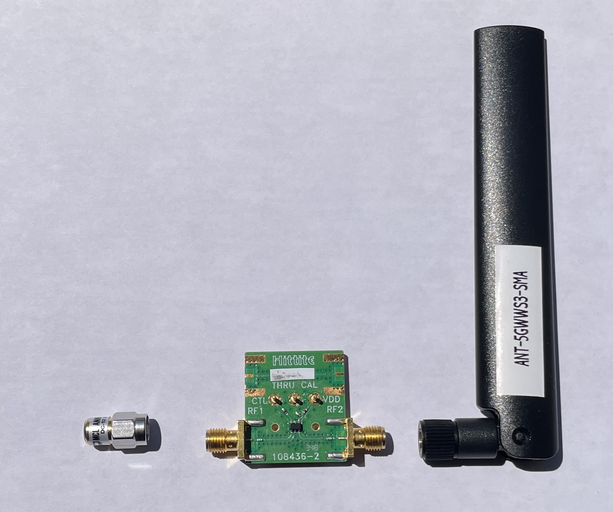
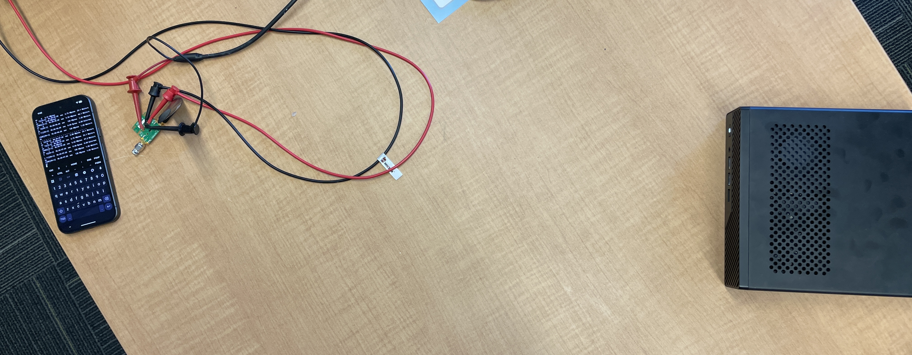
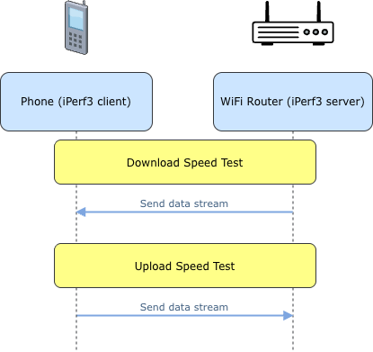

## Introduction

**Backscatter communication** is a system that allows a backscatter device to transmit signals without requiring a dedicated power source, such as a battery or wired power supply. This characteristic makes it particularly well-suited for Internet of Things (IoT) applications where energy sourcing and efficiency are often major design constraints. 

This system operates by using existing ambient radio signals (e.g., WiFi, cellular networks) in the following stages: 

1. Signal Harvesting: The device captures ambient radio signals that are already present in the environment.
2. Energy Conversion: A portion of the harvested signal is converted into energy to power the device.
3. Signal Reflection and Modulation: The remainder of that signal is reflected back into the environment. During reflection, the device modulates the signal to encode the data that it wants to transmit. 

## Motivation

Due its nature of relying on signal reflection, a backscatter communication environment always has two coexisting links. 
- **Legacy Link:** the pre-existing active signal in the environment, which the backscatter device harvests.
- **Backscatter Link:** the signal reflected and modulated by the backscatter device.

Because both links operate on the same radio frequency range, their signals may interfere with each other. This problem is known as **co-channel interference**. This project sets out to study the impact of backscatter communications on the exisiting communication (legacy) links. 

## Hardware details

- \[LEFT\] RF signal terminator (Mini-Circuits, ANNE-50L+, 50Ω impedance, DC to 12 GHz frequency range, [link](https://www.minicircuits.com/pdfs/ANNE-50L+.pdf))
- \[CENTER\] Backscatter tag (Hittite, 109266-HMC550A, DC to 6GHz frequency range, [link](https://www.analog.com/media/en/technical-documentation/data-sheets/hmc550ae.pdf))
- \[RIGHT\] RF signal anttenna (ANT-5GWWS3-SMA) 


Hardware modifications: All hardware components are used in our experiments *as is* without modification. 

Power subsystem:

RF specs:


## Software environment
We used [iPerf3](https://iperf.fr/iperf-doc.php) to measure and log WiFi data tranmission performance. For data analysis, we set up an Jupyter Notebook environment. The language we use is Python3, and all dependencies are specified in `requirements.txt`. 

Our data analysis environment should be agnostic to OS so long as it is reasonably up to date. We use Ubuntu 24.04 in our setup. 

Although various communication technologies (e.g., WiFi, cellular, Bluetooth) could be used as the legacy signal for a backscatter system, we selected WiFi for several reasons. First, it can be adjusted to high throughput which would make any degradation in performance more readily observable, whereas Bluetooth operates at low power levels, which would possibily make such effects harder to detect. Second, there is a richer list of experiment-ready software available for WiFi performance measurement compared to other technologies. All in all, WiFi offers relative simplicity in terms of setup and monitoring. 

## Reproducibility guide

1. Hardware assembly


2. Software environment setup
Run: 
```bash
git clone git@github.com:jehuddleston/en601616finalproject.git
cd en601616finalproject
python3 -m venv venv
source venv/bin/activate
pip install -r requirements.txt
```

